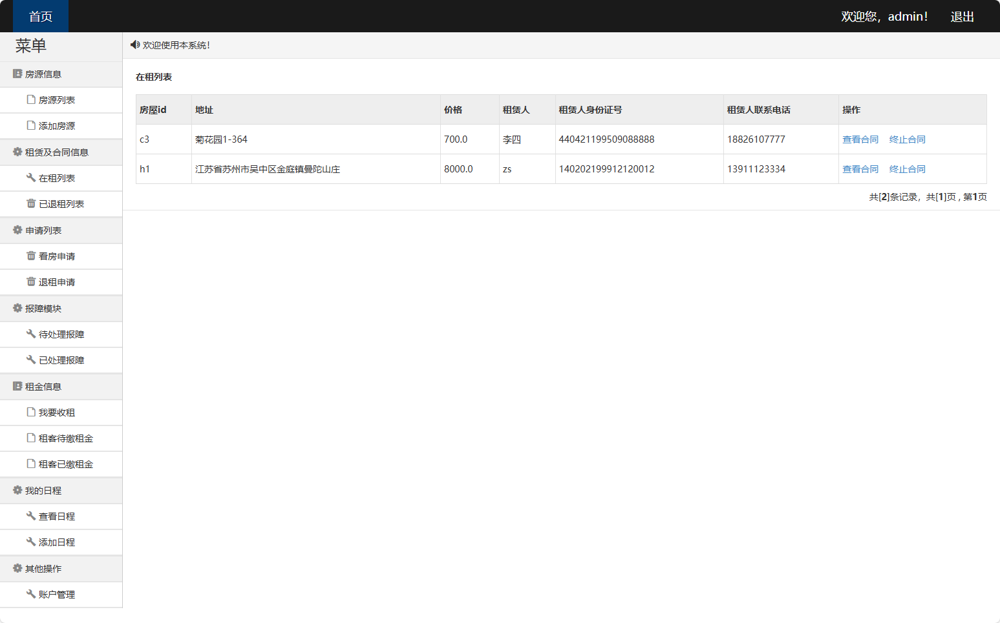

# 房屋租赁系统(文末免费领取☟)
> 
#### 介绍
房屋租赁系统(Java_SSM)
有BUG可留言加微

#### 软件架构
Java + SSM（Spring + SpringMVC + Mybatis） + Mysql

#### 项目功能说明

1.  管理员功能
> + 房源信息：房源列表、添加房源
> + 租赁及合同信息：在租列表、已退租列表
> + 申请列表：看房申请、退租申请
> + 报障模块：待处理报障、已处理报障
> + 租金信息：我要收租、租客待缴租金、租客已缴租金
> + 我的日程：查看日程、添加日程
> + 其他操作：账户管理
2.  租客功能
> + 房源信息：房源列表
> + 租赁信息：我的租赁、已退租列表
> + 我的申请：看房申请列表、退租申请列表
> + 报障模块：我要报障、未处理报障、已处理报障
> + 租金信息：待缴租金、已缴租金
> + 其他操作：账户管理

### 部分功能演示

### 环境需求(可免费提供)
- idea/eclipse、jdk-1.8、maven-3.8.6、mysql、node.js等

## 有项目修改、安装调试需求 请联系以下

## 获取资源扫☝☝☝

